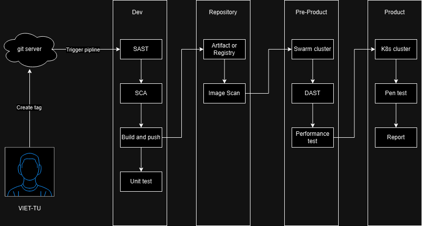

# DevSecOps pipeline workflow

[link demo][https://drive.google.com/drive/folders/1kLihfTtxMn07BkSZTFC98Vf3l6DfmGM4?usp=sharing]

+ Code Analysis (SAST): quét bảo mật source code, phân tích source code có đảm bảo clean hay không, có chỗ nào hard code, hay dùng hàm biến chưa phù hợp hay không. Chính xác đây là đánh giá ở phần source code hay đơn giản là dev code xong sẽ lém vào trong một công nghệ nào đó và công nghệ đó sẽ phần tích mã code đưa ra các kết quả để xem code đó có đủ đáp ứng yêu cầu để tiếp tục các bước tiếp theo hay không ==> Phần tích mã nguồn (Ví dụ: `sonarqube`)
+ Composition analysis (SCA): phân tích thành phần phần mềm, kiểm tra và đánh giá các thành phần của phần mềm bao gồm: thư viện, framework, và các module của phần mềm. Mục tiêu sẽ là phát hiện ra các vấn đề bảo mật, xem đã tuân thủ các giấy phép và các rủi ro khác liên quan đến các thành phần bên thứ 3 hay chưa (VD: `Synk`) 
+ Build và push dự án 
+ Security test or Unit test: do hoàn toàn của dev viết cái logic của dev viết ra là login thì sẽ đi từ controller vào service rồi đến model, context connection để chính xác lấy dữ liệu từ database thì quá trình đó đảm bảo chạy đúng thì ta cần có bước viết unit test và security test ở đó luôn
+ Image assurance: quét bảo mật docker image, vì trong môi trường docker cũng có hệ đìều hành cũng như các cài đặt các công cụ cần thiết để chạy được dự án thế nên cũng cần quét bảo mật 
+ Deploy to pre-production chạy chính thức thành website hoàn chỉnh 
+ Vulnerability scanning (DAST): cái bước này sẽ giả lập quá trình tấn công website như là XSS, SQL injection, command injection ... để xem là có những lỗ hổng bảo mật nào khi website đang chạy thật không 
+ Performance testing: kiểm tra hiệu suất website, tính chịu tải website, đo lường thời gian phản hồi của máy chủ rồi số lượng yêu cầu thành công và thất bại và nhiều cách thứ đo hiệu suất khác. Mực đích trước khi triển khai trên môi trường prodcut dể mà tiết kiệm tài nguyên thì ta sẽ tiến hành chạy độc lập hoặc chạy với nhiều container rồi tiến hành kiểm tra performance cũng như sizing làm sao cho phù hợp nhất, tối ưu tài nguyên nhất lúc đó thì ta mới tiến hành deploy lên môi trường production ==> Ta giả sử website thực tết khi mọi người truy cập hàng giờ là 1 triệu người, từ đó ta sẽ lên một kịch bản 1 triệu người đó và kiểm tra hiệu suất website như thông số phản hồi ta đặt  ngưỡng kiểm tra là bao nhiêu từ đó sizing làm sao cho phù hợp nhất, tối ưu tài nguyên nhất
+ Sau quá trình kiểm tra trên môi trường pre-product nếu ok với thông số đưa ra thì ta sẽ tiết hành triển khai trên môi trường product trên cloud là EKS
+ Rồi đến bước report và tức là các kết quả kiểm tra ta sẽ tiến hành báo cáo và lưu lại để xem là qua từng version triển khai thì có những cải thiện nào không
+ khi đã chạy ổn định thì tiến hành monitoring và health check  và backup store
